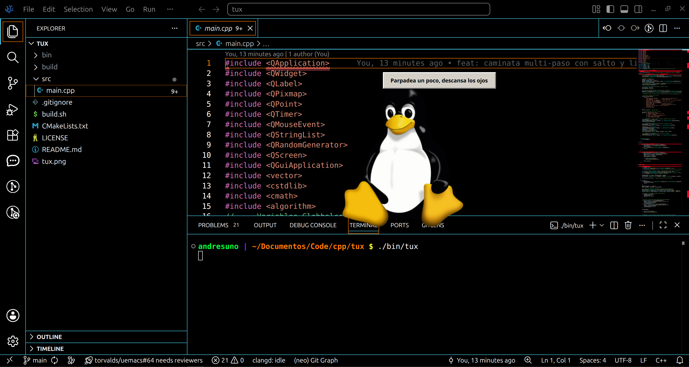

# Tux Asistente



Un pequeño Tux flotante para tu escritorio Linux, hecho con **C++** y **Qt6**. Camina solo por la pantalla, te habla de vez en cuando y puedes arrastrarlo con el mouse.


## Características

- Ventana flotante sin bordes, siempre encima (*always on top*) y con fondo transparente.
- Cada cierto tiempo, Tux inicia una **caminata**: elige una dirección y una distancia total al azar, y la recorre en varios saltos consecutivos (no un solo salto a un punto fijo).
- Cada paso del recorrido tiene una animación de salto (squash & stretch suave), sin necesidad de un spritesheet nuevo.
- Respeta los bordes de la pantalla: si Tux choca con un borde, corta el recorrido ahí en vez de salirse.
- El sprite se voltea automáticamente según la dirección en la que camina.
- Bocadillo de diálogo estilo retro (look clásico gris de interfaz de los 90) con mensajes aleatorios tipo "recuerda tomar agua", "estira la espalda", etc.
- Arrástralo por la pantalla con clic izquierdo.
- Clic derecho para cerrarlo.

## Requisitos

- CMake ≥ 3.16
- Compilador con soporte C++17 (GCC, Clang, etc.)
- Qt6 (componente `Widgets`)
- Sistema con soporte OpenGL / Vulkan headers / XKB (dependencias típicas de Qt6 en Linux)

## Compilación

El proyecto incluye un script que automatiza todo el proceso en sistemas tipo Unix:

```bash
./build.sh
```

Esto va a:
1. Limpiar y recrear la carpeta `build/`.
2. Generar el Makefile con CMake.
3. Compilar el proyecto.
4. Mover el binario resultante a `bin/tux`.

## Ejecución

```bash
./bin/tux
```

> **Nota:** el binario busca `tux.png` en el directorio desde el que se ejecuta, así que corre el comando desde la raíz del proyecto (o copia `tux.png` junto al ejecutable, por ejemplo 'cp tux.png bin/tux.png').

## Estructura del proyecto

```
.
├── bin/            # Binario compilado (ignorado por git)
├── build/          # Archivos de build de CMake (ignorado por git)
├── src/
│   └── main.cpp    # Lógica principal del asistente
├── build.sh        # Script de compilación
├── CMakeLists.txt  # Configuración de CMake
├── tux.png         # Sprite de Tux
└── README.md
```

## Personalización

Dentro de `src/main.cpp` hay algunas variables globales fáciles de ajustar:

| Variable | Descripción |
|---|---|
| `speak` | Activa o desactiva los mensajes del bocadillo |
| `rmove` | Activa o desactiva el movimiento aleatorio |
| `sizeTux` | Tamaño en píxeles del sprite |
| `initPosX` / `initPosY` | Posición inicial en pantalla |
| `margenSalto` | Espacio extra arriba de la ventana para que el salto no se recorte |

También podés ajustar, dentro de la clase `VentanaFlotante`:

| Dónde | Qué controla |
|---|---|
| `timerMovimiento->start(8000)` | Cada cuánto tiempo decide iniciar una nueva caminata (en ms) |
| `distanciaTotal` en `decidirCaminata()` | Rango de distancia total del recorrido (actualmente 80–480 px) |
| `pasoPx` en `decidirCaminata()` | Largo de cada "zancada" del recorrido |
| `timerCaminata->start(180)` | Tiempo entre cada salto del recorrido (en ms) |
| `escalas` / `offsetsY` en `animarPaso()` | Intensidad del squash & stretch y la altura del salto |

También puedes editar la lista `mensajes` para cambiar las frases que dice Tux.

## Ideas a futuro

- [x] Animación de caminado (squash & stretch al saltar, sin sprite sheet).
- [ ] Detección de inactividad del mouse/teclado.
- [ ] Configuración por archivo externo (JSON/TOML) en vez de constantes en el código.
- [ ] Empaquetado (AppImage / paquete para distros).

## Licencia

Este proyecto está licenciado bajo la **GNU General Public License v3.0**. Consulta el archivo [LICENSE](./LICENSE) para más detalles.
